<!-- BANNER -->
  <h1>Recolored Kali Wallpapers</h1>
<h1 align="center">
  
   
  
This project will be updated according to requests

</h1>

Kali Red

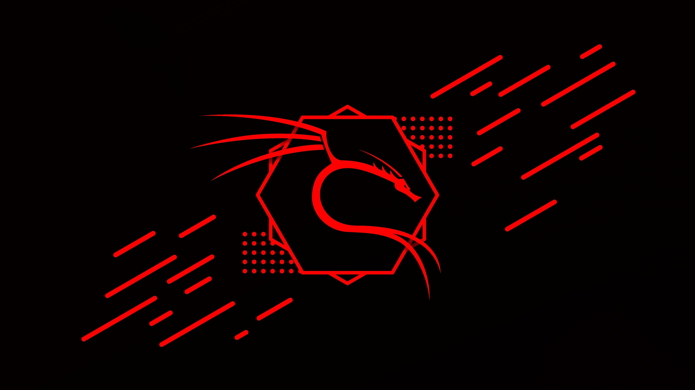

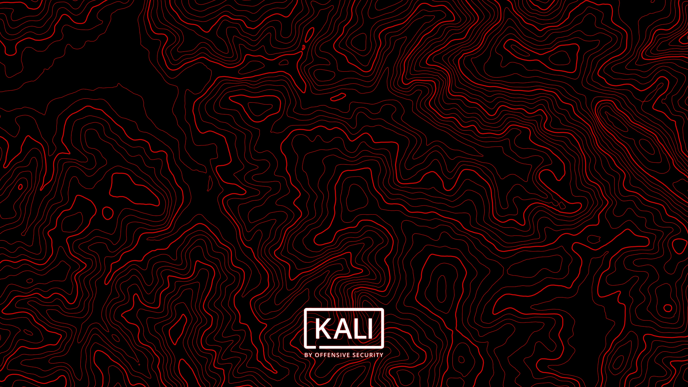

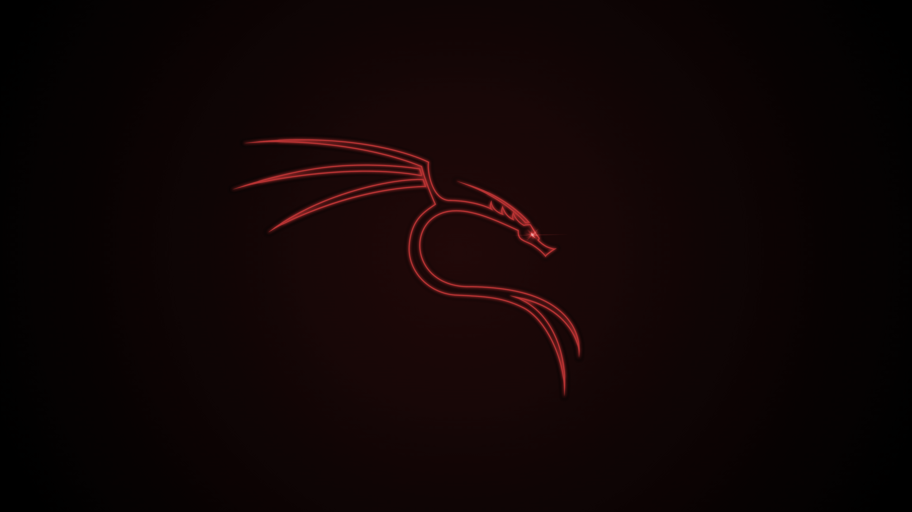

 
  

Kali Green

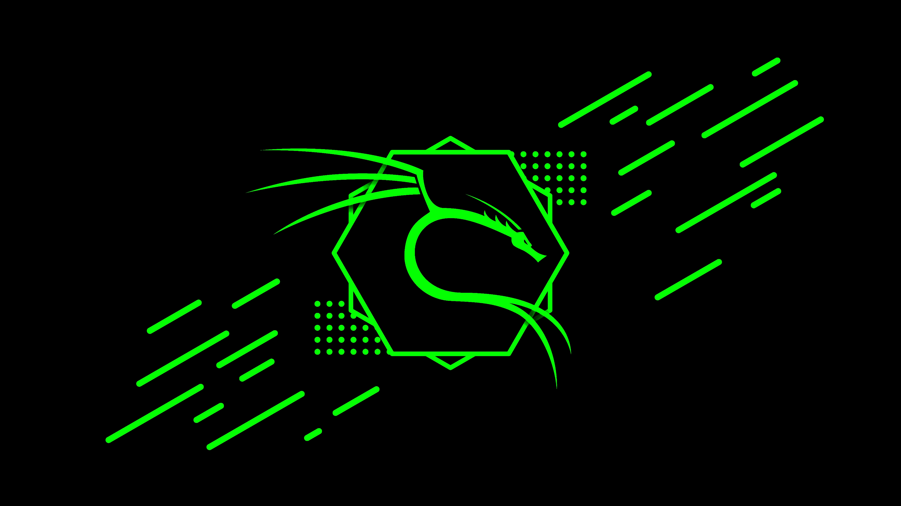

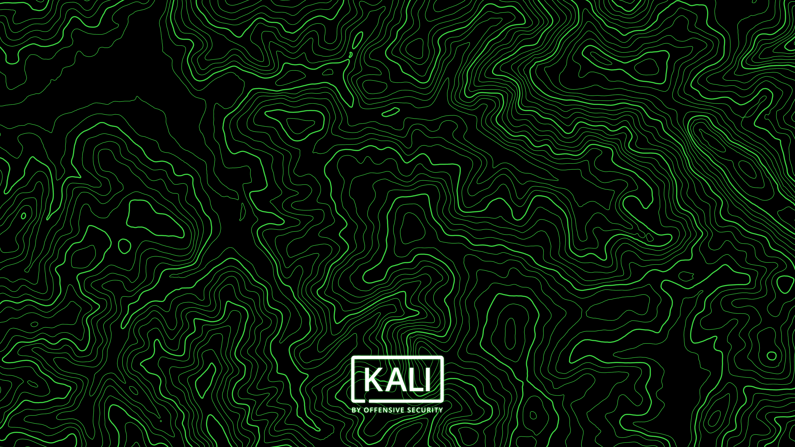

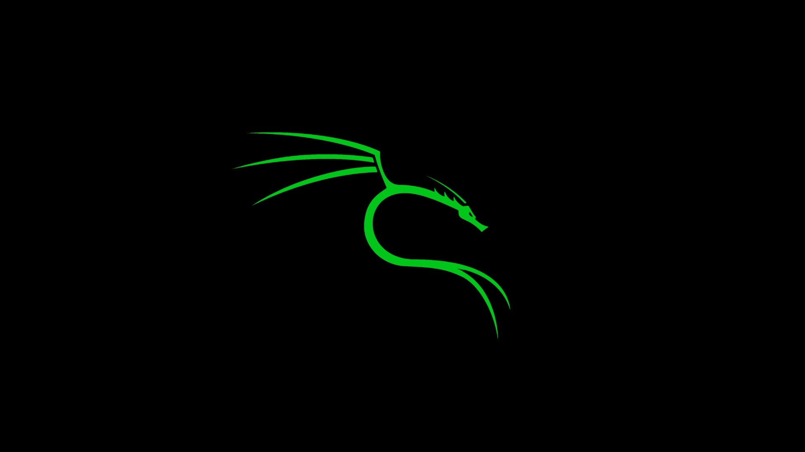

 

Kali Cyan

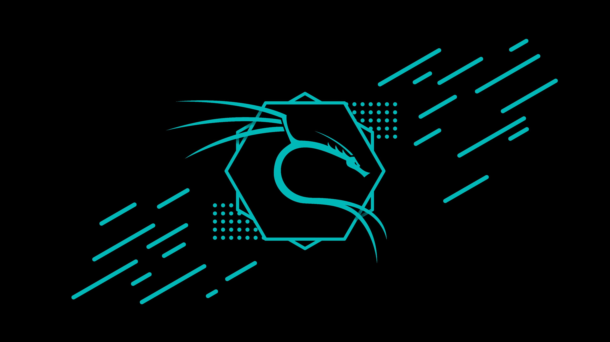

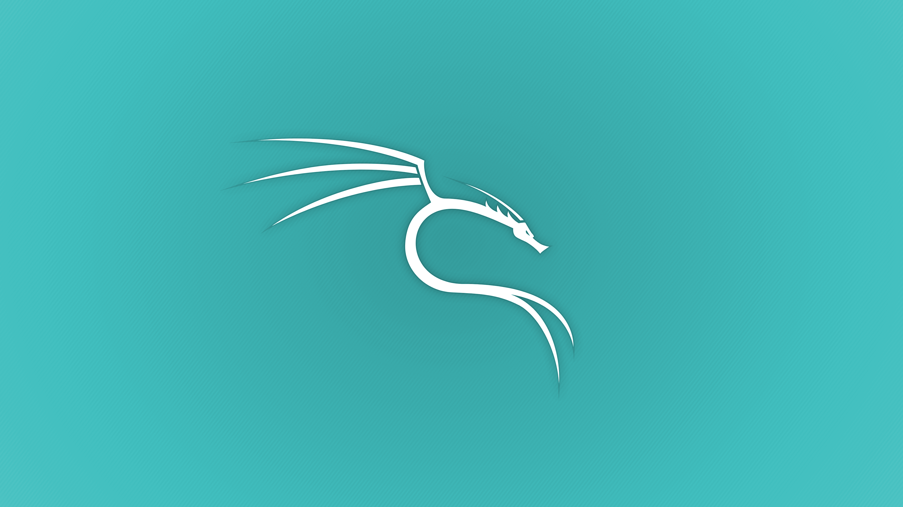

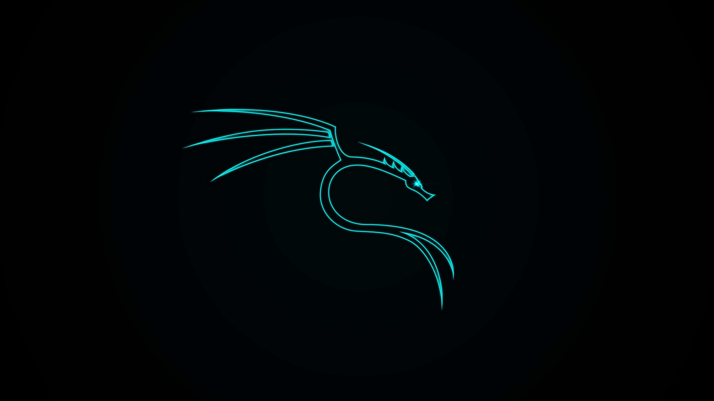

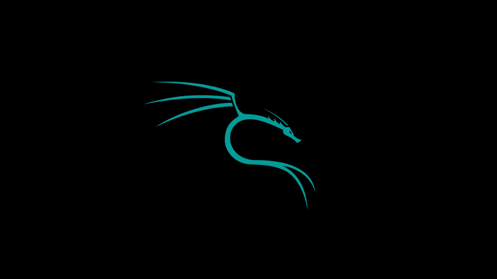

 

Kali Yellow

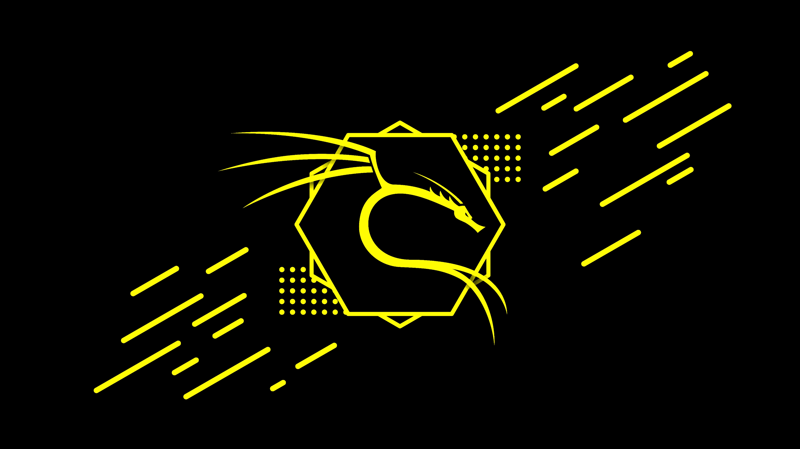

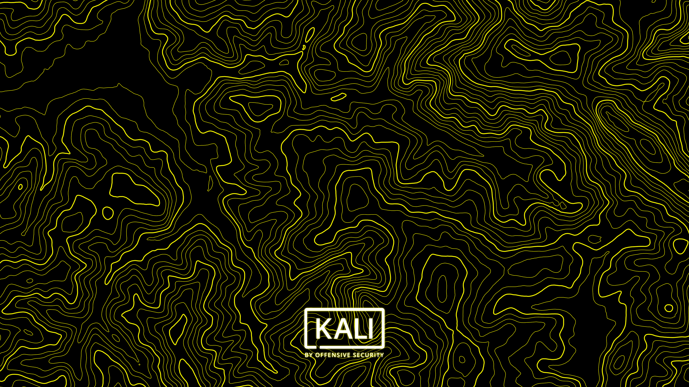

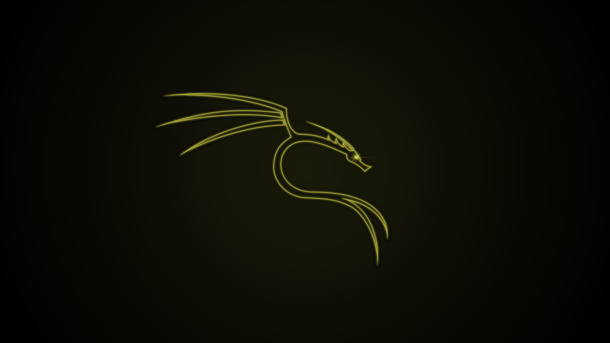

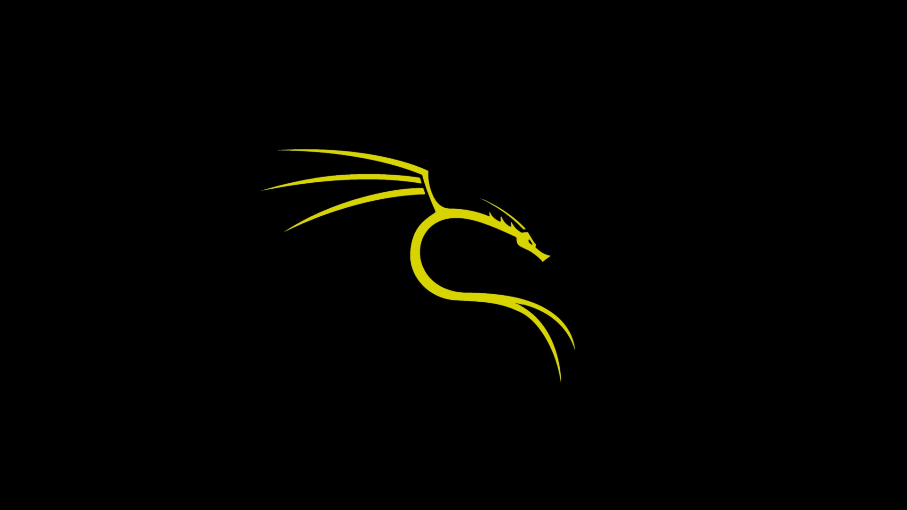

 

<!-- LICENSE -->
<h2>License</h2>

Distributed under the MIT License. See `LICENSE` for more information
